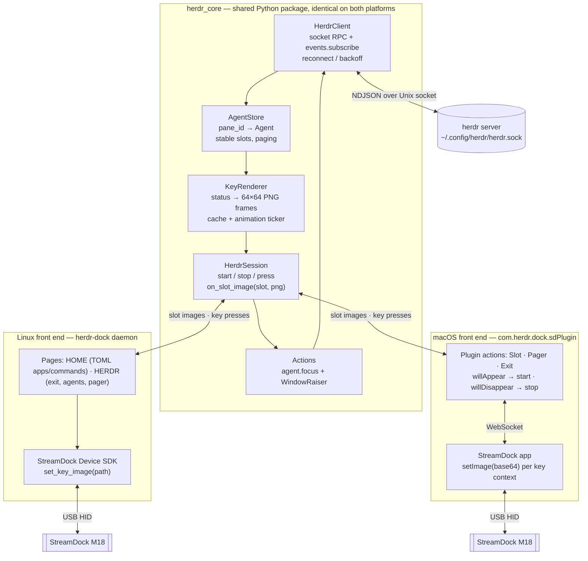
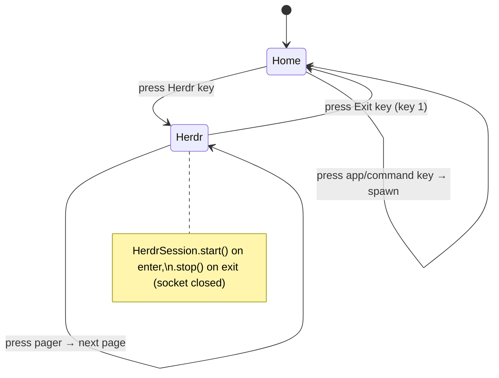
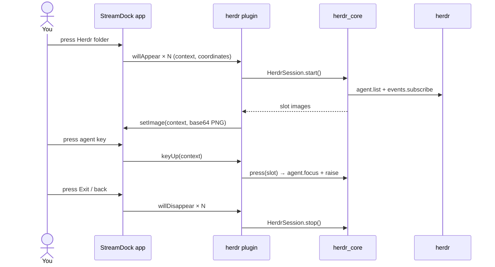
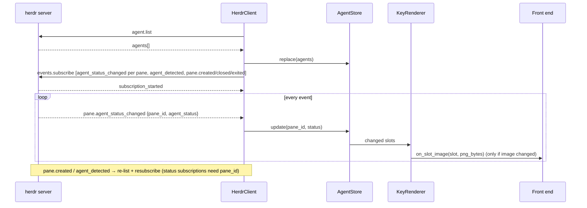
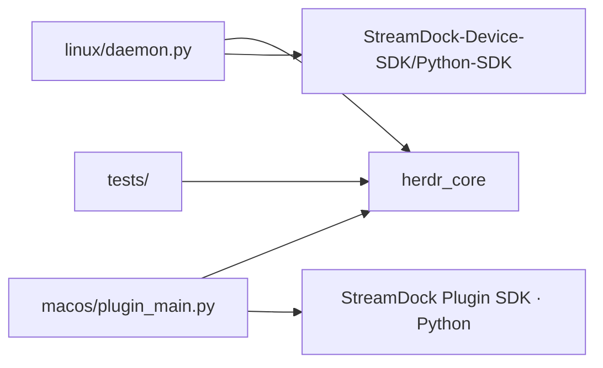

# herdr-dock — design

Show every herdr coding agent as a key on a StreamDock **M18**, recolour the key
live as the agent's status changes, and press a key to jump to that agent.
The agent keys appear only in **Herdr mode**. One Herdr button enters the mode, and one Exit
button leaves it.

Platforms: **Linux** (our own daemon on the Device SDK) and **macOS** (a plugin for the
official StreamDock app). Both use the same herdr core.

## Engineering rules

These rules are binding for all code in this repo. A change that breaks one isn't finished.

### Testing: at least 80 % coverage

- `pytest` + `pytest-cov` + `pytest-asyncio`. Coverage is measured on **our** packages
  (`herdr_core`, `linux`, `macos`) with branch coverage on. Vendored SDKs are excluded.
- The gate is in `pyproject.toml` (`[tool.coverage.report] fail_under = 80`), so
  `pytest --cov` fails below 80 %. `herdr_core` should aim for 90 % or more, because it holds the logic.
- Every behaviour change ships with tests in the same change. Bug fixes start with a
  failing test that reproduces the bug.
- No real hardware, herdr server, StreamDock app or OS window manager in unit tests.
  They talk to fakes:
  - `FakeHerdrServer`: an asyncio Unix-socket server that speaks the NDJSON protocol,
    replays scripted events, and records requests.
  - `FakeDevice` / `FakeAppConnection`: record images and inject key presses.
  - `FakeClock` / injected ticker: animation tests run without real sleeping.
- Hardware/app adapters stay thin (they only translate calls). They're covered by a small set of
  **opt-in integration tests** (`pytest -m hardware`, `pytest -m herdr_live`) that are skipped by default.
- `# pragma: no cover` only on code that can't run in CI (for example a platform-specific `if`
  branch), and each one needs a one-line reason next to it.
- Tests are fast (the full unit suite runs in under 10 s) and deterministic: no sleeps and no network.

### Design: SOLID

| Principle | How it applies here |
|-----------|---------------------|
| **S**ingle responsibility | One reason to change per class: `HerdrClient` = protocol/transport, `AgentStore` = state + slot assignment, `Pager` = paging, `KeyRenderer` = pixels, `Animator` = timing, `WindowRaiser` = OS command, `HerdrSession` = orchestration only. Front ends only map keys and push images. |
| **O**pen/closed | New statuses, glyphs, colours or label styles come from data (theme/config tables), not `if` chains. New front ends (another device, Windows) are new adapters, with no edits to `herdr_core`. New home-page key types register a handler and don't change the dispatcher. |
| **L**iskov substitution | Every implementation of a port must pass the same **contract test suite** (`tests/contracts/`). `FakeDevice`, the SDK device adapter and the app adapter are interchangeable from the session's point of view. |
| **I**nterface segregation | Small `typing.Protocol` ports instead of one big interface: `HerdrApi` (list/focus), `HerdrEvents` (subscribe), `KeySurface` (`show(slot, png)`, `slot_count`), `KeyInput` (press callbacks), `Raiser`, `Clock`. Consumers depend only on what they use. |
| **D**ependency inversion | `herdr_core` depends on those Protocols, never on the StreamDock SDK, the plugin SDK, `subprocess`, sockets or `time` directly. Concrete adapters are wired up in one composition root per front end (`linux/daemon.py`, `macos/plugin_main.py`). |

### Code conventions

- Python ≥ 3.11, fully type-annotated, `mypy --strict` clean on `herdr_core`. `ruff` for
  lint and format.
- Immutable value objects (`@dataclass(frozen=True)`) for `Agent`, `SlotView` and `Config`.
  The store returns new snapshots instead of objects that change underneath you.
- asyncio for all I/O in the core. Blocking SDK calls run in the adapter's worker thread, never on
  the event loop.
- No global state or singletons. Configuration is passed in explicitly.
- Errors at boundaries are typed (`HerdrUnavailable`, `DeviceGone`) and handled where
  recovery is decided (the session or front end), not swallowed in adapters.
- Logging through `logging`, one logger per module, with no `print` outside CLI entry points.

## Decisions

| Topic            | Decision |
|------------------|----------|
| Device           | StreamDock M18: 15 LCD keys (3×5), 64×64 JPEG; animation = host-side frame swaps |
| Shared core      | `herdr_core` Python package: herdr socket client, agent store, paging, key renderer, focus + raise |
| Linux front end  | Our own daemon on `StreamDock-Device-SDK/Python-SDK`, with a TOML-defined home page (apps, commands, Herdr key) |
| macOS front end  | StreamDock app plugin (`.sdPlugin`) built with the official Python plugin SDK and packaged with PyInstaller |
| herdr transport  | Native socket API (NDJSON over Unix socket); no herdr plugin SDK required |
| Scope            | All agents in all workspaces of the default herdr session |
| Mode             | One Herdr button enters Herdr mode, one Exit button leaves it. herdr is connected **only while in Herdr mode** |
| Key press        | `agent.focus` in herdr **and** raise the terminal window; the raise command is set in config for each OS |
| Overflow         | Pager key when agents exceed the free keys |

## Overview



The front ends only map **physical keys ↔ slots** and push images. Everything to do with
herdr lives in the core.

## Herdr mode: one button in, one button out

### Key layout in Herdr mode (M18, 3×5, logical keys)

| | col 1 | col 2 | col 3 | col 4 | col 5 |
|---|:---:|:---:|:---:|:---:|:---:|
| **row 1** | **◀ Exit** (key 1) | A1 (key 2) | A2 (key 3) | A3 (key 4) | A4 (key 5) |
| **row 2** | A5 (key 6) | A6 (key 7) | A7 (key 8) | A8 (key 9) | A9 (key 10) |
| **row 3** | A10 (key 11) | A11 (key 12) | A12 (key 13) | A13 (key 14) | A14 **or** Pager `1/2 ▶` (key 15) |

- key 1: Exit Herdr mode (always)
- keys 2–14: agent slots (13 per page when paging)
- key 15: agent slot A14 when everything fits, or the pager when agents > 14

- **Exit** is always on key 1. It shows `◀ herdr` and a mini summary, for example a red dot
  if any agent is blocked.
- With up to 14 agents there is no pager. With 15 or more, key 15 becomes the pager: it shows
  `1/2 ▶` plus coloured dots for the statuses on the other pages, so an off-screen
  `blocked` agent is still visible.
- On Linux, the M18's extra non-LCD inputs (logical keys 16–18, if present) can also act
  as Exit and Pager.

### Linux



The daemon owns the whole device, so the Exit key is ours. Entering Herdr mode calls
`HerdrSession.start()`, and Exit calls `.stop()`, which closes the subscription and drops
the herdr connection. Then the daemon redraws the home page.

### macOS

The StreamDock app owns the pages, and the plugin SDK has **no command to switch pages or
profiles** (open request:
[StreamDock-Plugin-SDK#33](https://github.com/MiraboxSpace/StreamDock-Plugin-SDK/issues/33)).
So on the Mac:

- **Herdr button** = a normal **folder** you create in the StreamDock app.
- **Exit button** = the folder's back key on key 1. Inside the folder you place the plugin's
  **"Herdr Exit"** action on key 1, configured as the folder's back key if the app allows
  that. If it doesn't, the app's built-in folder back key goes on key 1 (see Open items).
- Keys 2–15 inside the folder hold **"Herdr Agent Slot"** actions, and key 15 can hold the
  **"Herdr Pager"** action instead.
- Lifecycle comes from visibility: the first `willAppear` of any plugin action calls
  `HerdrSession.start()`, and when the last one gets `willDisappear` the plugin calls `.stop()`.
  Nothing talks to herdr while you're outside the folder.



## herdr_core

### Status-change flow (both platforms)



### Front-end interface

```python
class HerdrSession:
    def __init__(self, config, on_slot_image: Callable[[int, bytes], None]): ...
    def set_slot_count(self, n_agent_slots: int, has_pager: bool): ...  # from the layout
    async def start(self): ...        # connect, list, subscribe, render all slots
    async def stop(self): ...         # unsubscribe, close socket, cancel timers
    async def press(self, slot: int): ...  # agent slot → focus+raise; pager → next page
    def exit_image(self) -> bytes: ...     # Exit key face with blocked/done summary
```

Slot numbering is logical (0..n), and each front end maps it to physical keys:
- Linux: the daemon maps logical keys 2..15 to slot indexes.
- macOS: the plugin derives the slot from the `coordinates` (row, column) in the
  `willAppear` payload. A "slot #" setting in the Property Inspector is the fallback.

### herdr API facts (verified against herdr 0.8.2, protocol 20)

- Socket: `herdr status server` prints the path (`~/.config/herdr/herdr.sock` here). The core
  resolves the path in this order: config value, then the `HERDR_SOCKET` env var, then the
  `herdr status server` output, then the default path. On macOS the StreamDock app starts
  the plugin with a minimal `PATH`, so the plugin also searches `/opt/homebrew/bin`
  and `/usr/local/bin` for `herdr`.
- Framing: one JSON object per line. Request: `{"id","method","params"}`. Response:
  `{"id","result"}`, or an error.
- Ordinary requests: the server closes the connection after replying. Open a new
  connection for each RPC.
- `events.subscribe` keeps the connection open. The server first replies `subscription_started`,
  then sends `{"event": "...", "data": {...}}` lines.
- `pane.agent_status_changed` subscriptions **require `pane_id`**, so the core
  resubscribes whenever the set of agent panes changes.
- Statuses: `idle`, `working`, `blocked`, `done`, `unknown`. `done` means the agent
  finished background work that hasn't been seen yet. Focusing the agent marks it seen and it
  becomes `idle`.
- `agent.list` fields used: `pane_id`, `workspace_id`, `tab_id`, `agent`, `agent_status`,
  `cwd`, `terminal_title_stripped`, `focused`.
- Focus: `agent.focus {"target": "<pane_id>"}`.

### Key appearance (64×64)

Symbols and colour roles match herdr's sidebar with `status_indicators = "symbols"`
(herdr source, `src/client/shell.rs`: `status_icon` and `status_color`). An agent looks the
same on the dock as in herdr.

| Status   | herdr symbol | herdr colour role | Default key colour | Animation |
|----------|:-----:|-------------|----------------|-----------|
| blocked  | `×`   | red         | `#e64553` | **Blink**: alternate the full-colour frame with an inverted/dark frame (default 2 Hz) |
| done     | `✓`   | teal        | `#179299` | **Slow pulse** (optional): bright/dim every ~1.5 s until seen |
| working  | `◐`   | yellow      | `#df8e1d` | **Spinner**: `◐ ◓ ◑ ◒` rotating (default 4 frames/s) |
| idle     | `○`   | green       | `#40a02b` | static |
| unknown  | `·`   | overlay0    | `#7c7f93` | static |
| focused  | —     | —           | white 2 px border | static overlay on top of any state |
| offline  | —     | —           | black, `herdr offline` | static |

- **Needs attention** means `blocked`, which always blinks. Making `done` pulse is a
  config option (`attention = ["blocked", "done"]`), so unseen finished work also catches your
  eye. Pressing the key focuses the agent, herdr marks it seen (done becomes idle), and
  the animation stops by itself.
- Key layout: the large status symbol in the centre, the agent kind (`claude`, `codex`, …) above it
  in small text, and the label below it. The default label is the cwd basename, and
  `label = "title" | "cwd" | "name"` changes it.
- Colours are overridable in config (`[colors]`). Default hex values follow herdr's
  Catppuccin-style palette roles (red, teal, yellow, green, overlay0).
- Font: bundle **DejaVu Sans** (permissive licence). It covers `× ✓ ◐ ◓ ◑ ◒ ○ ·`, so keys
  render the same on Linux and macOS whatever fonts are installed.
- The Exit key and pager also blink red when an agent on another page (or any agent, for Exit) is
  `blocked`.

### Animation: how it works

There's no on-device animation. Both platforms swap static frames from the host:

- **macOS app:** animated icons you set by hand in the StreamDock app are GIFs that the
  app plays frame by frame. A plugin gets the same effect by calling `setImage` repeatedly.
- **Linux SDK:** `set_key_gif` and `GifController` also stream frames from the host.

So `herdr_core` owns one **animation ticker**:

- Every frame is pre-rendered when the state changes and cached by
  `(kind, label, status, focused, frame)`, so a tick only pushes bytes and never renders.
- One asyncio timer ticks at the least common multiple needed (4 Hz). Each animated key advances
  only on its own beat: blink at 2 Hz, spinner at 4 Hz, done pulse at about 0.7 Hz.
- Ticks are only sent for keys that are **visible and animated**. Static keys get no
  traffic, and nothing ticks outside Herdr mode.
- Blinks are in phase across keys, so several blocked agents flash together instead of
  flickering out of step.
- Config: `animate = true`, `blink_hz = 2`, `spinner_fps = 4`, `attention = ["blocked"]`.
  If the device or app can't keep up (see Open items), the spinner drops to a static `◐`
  but blocked keeps blinking, because blinking matters most.

### Ordering & paging

- Ordering is stable: workspace order, then tab, then pane. An agent keeps its slot until it
  exits, and new agents fill gaps instead of reshuffling the other keys.
- Page size = number of agent slots (14 without a pager, 13 with one). The pager cycles
  through the pages, and the current page is remembered while you stay in Herdr mode.

### Window raising (configurable)

Each OS has its own command template in config, with `{pane_id}`, `{workspace_id}` and `{cwd}`
filled in:

```toml
[raise]
enabled = true
linux = "hyprctl dispatch focuswindow class:com.mitchellh.ghostty"
macos = "osascript -e 'tell application \"Ghostty\" to activate'"
```

Example presets will be documented for Ghostty, Alacritty, Kitty, iTerm2 and Terminal.app.

## Linux front end: `herdr-dock` daemon

- Opens the M18 with the Device SDK and owns all 15 keys and the 3 extra inputs.
- **Home page** from TOML. Each key is one of these:
  - `run`: a shell command, spawned detached (`setsid`, output to the log)
  - `app`: launches a desktop app (`gtk-launch <desktop-id>` or `uwsm app -- …` on Omarchy)
  - `herdr`: the Herdr mode button. Its face shows a live mini summary only while in Herdr
    mode. On the home page it is a static icon, so the home page doesn't connect to herdr.
- **Herdr page** uses the layout above. Key 1 = Exit.
- Device I/O runs on one worker thread. Key callbacks are passed to the asyncio loop with
  `loop.call_soon_threadsafe`.
- SDK quirk: `set_key_image(key, path)` takes a file path and writes a temporary JPEG into the
  **current working directory**, so the daemon `chdir`s to `$XDG_RUNTIME_DIR/herdr-dock`.
- Hot-plug: `DeviceManager.listen()` together with the device change callback. On reconnect,
  redraw the current page.
- Runs as a systemd `--user` service. The udev rule from `99-streamdock.rules` must cover the
  M18 VID/PID so it runs without sudo.

```toml
# ~/.config/herdr-dock/config.toml
herdr_socket = ""            # empty = auto-detect
label = "cwd"                # cwd | title | name
brightness = 70
animate = true
blink_hz = 2
spinner_fps = 4
attention = ["blocked"]   # add "done" to pulse unseen finished work
resync_seconds = 30

[raise]
enabled = true
linux = "hyprctl dispatch focuswindow class:com.mitchellh.ghostty"

[[home]]
key = 1
label = "Herdr"
herdr = true                 # enters Herdr mode

[[home]]
key = 2
label = "Firefox"
icon = "~/.config/herdr-dock/icons/firefox.png"
app = "firefox"

[[home]]
key = 3
label = "Build"
run = "cd ~/Projects/foo && make"
```

## macOS front end: `com.herdr.dock.sdPlugin`

- Built on the official Python plugin SDK (`SDPythonSDK`: WebSocket client, Action
  classes, PyInstaller spec). It is packaged as a single executable named in `CodePath`,
  with `herdr_core` bundled in.
- Manifest actions:

  | UUID | Name | Behaviour |
  |------|------|-----------|
  | `com.herdr.dock.slot`  | Herdr Agent Slot | Shows agent N of the current page; press → focus + raise |
  | `com.herdr.dock.pager` | Herdr Pager      | `1/2 ▶`, cycles pages |
  | `com.herdr.dock.exit`  | Herdr Exit       | Exit key face (summary); see Open items for back navigation |

- Events used: `willAppear`, `willDisappear`, `keyUp`, `didReceiveSettings`. Commands used:
  `setImage` (base64 PNG) and `setTitle` (empty, because the image already has the text).
- Lifecycle: a reference count of visible plugin contexts. Going from 0 to 1 calls `start()`, and going from 1 to 0 calls `stop()`.
- The `raise.macos` command still applies. The StreamDock app itself doesn't take focus
  when a key is pressed.
- Install: copy the `.sdPlugin` folder into the StreamDock plugins directory and restart the
  app. Then create a folder named "Herdr" and drag the actions onto keys 1–15.
- Using the Device SDK daemon on macOS is still possible, but it can't run alongside the
  StreamDock app because only one can hold the device. That's why the plugin is the macOS route.

## Project layout

| Path | Purpose |
|------|---------|
| `DESIGN.md` | This document |
| `pyproject.toml` | Package metadata and dependencies |
| `herdr_core/client.py` | Socket RPC, subscription stream, reconnect/backoff |
| `herdr_core/store.py` | AgentStore, slots, paging |
| `herdr_core/render.py` | Pillow key renderer, frame cache (PNG bytes), bundled DejaVu Sans |
| `herdr_core/session.py` | HerdrSession (start/stop/press/on_slot_image), animation ticker |
| `herdr_core/raise_window.py` | Per-OS raise command runner |
| `herdr_core/config.py` | Config loading |
| `linux/daemon.py` | Pages (home/herdr), Device SDK wrapper, launcher |
| `linux/herdr-dock.service` | systemd `--user` unit |
| `macos/com.herdr.dock.sdPlugin/` | `manifest.json`, `static/img/`, `propertyInspector/slot/index.html` |
| `macos/plugin_main.py` | Python plugin SDK actions → HerdrSession |
| `macos/plugin.spec` | PyInstaller build |
| `herdr_core/ports.py` | `typing.Protocol` ports: `HerdrApi`, `HerdrEvents`, `KeySurface`, `KeyInput`, `Raiser`, `Clock` |
| `tests/unit/` | Store/paging/render/animator/session tests |
| `tests/contracts/` | Shared contract suites that every port implementation must pass |
| `tests/fakes/` | `FakeHerdrServer`, `FakeDevice`, `FakeAppConnection`, `FakeClock` |
| `tests/integration/` | Opt-in `hardware` / `herdr_live` tests (skipped by default) |



## Resilience

| Failure | Handling |
|---------|----------|
| herdr not running / restarted | Exponential backoff reconnect (0.5 s → 10 s), keys show offline, full resync on reconnect |
| Missed events | Periodic `agent.list` resync every `resync_seconds` while in Herdr mode |
| Device unplugged/replugged (Linux) | Hot-plug callback → reopen, reapply brightness, redraw current page |
| StreamDock app restarts (macOS) | Plugin process restarts. Contexts reappear through `willAppear` and the session restarts |
| Rapid status flapping | Coalesce redraws per key (~50 ms debounce) |
| Leaving Herdr mode mid-request | `stop()` cancels in-flight tasks. Late events are ignored |

## Milestones

1. **herdr_core**: client, store, session, with a console printer of live agent states
   and tests against a fake socket. No device needed.
2. **render.py**: render keys to PNG files for visual review.
3. **Linux daemon**: home page from TOML (run/app/herdr keys), Herdr mode with Exit,
   agent keys, focus + raise.
4. **Linux polish**: paging, extra inputs, working animation, systemd unit, udev check.
5. **macOS plugin**: manifest, slot/pager/exit actions, visibility lifecycle, PyInstaller
   build, install + folder setup guide.

## Open items

- **M18 hardware**: confirm the VID/PID on the unit (for the udev rule) and whether logical keys
  16–18 exist on this model.
- **macOS Exit key**: check whether the StreamDock app lets a folder's back key be placed
  on key 1 or swapped for a plugin action. If it can't, Exit is the app's own folder back
  key and the plugin's Exit action becomes an optional status-summary key. A plugin action
  can't trigger "go back" itself until the SDK adds page switching (#33).
- **macOS slot mapping**: confirm that `willAppear` includes `coordinates` for the M18. If it
  doesn't, use the Property Inspector "slot #" setting.
- **macOS plugin directory**: confirm the path the StreamDock app loads `.sdPlugin` folders
  from.
- **Animation rate**: measure how fast `set_key_image` + `refresh` (Linux) and `setImage`
  (macOS) are on the M18. The target is 4 frames/s on a few keys. If it's too slow, drop the
  spinner first and keep the blink. Also check whether `setImage` accepts an animated GIF data
  URL and the app plays it. If it does, attention keys could be sent once instead of ticked.
- **Multiple herdr sessions**: out of scope for now. The client already takes a socket path.
