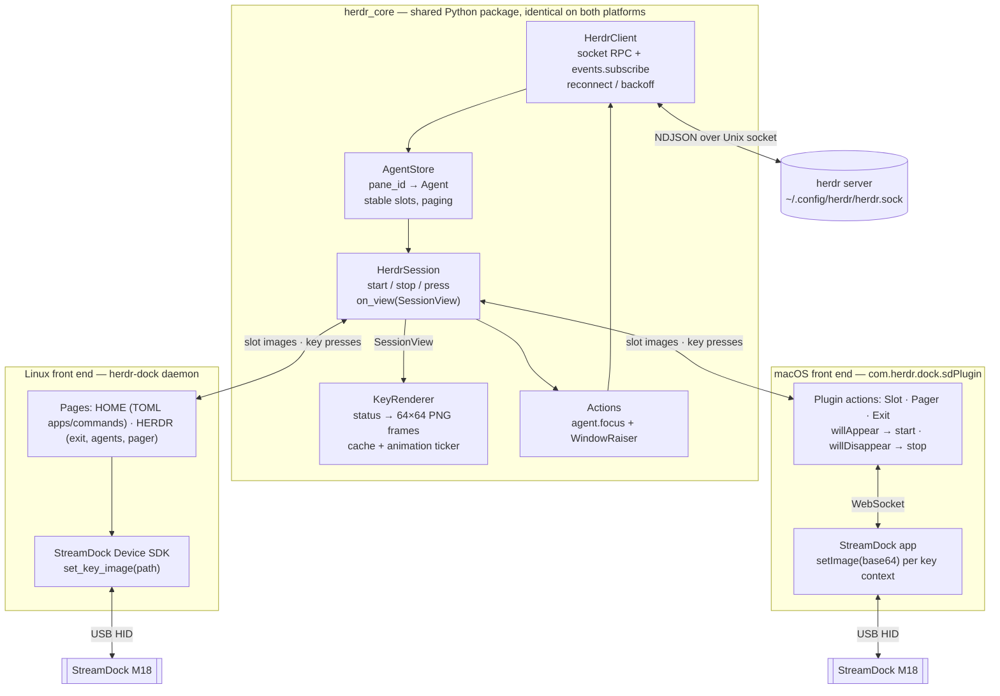
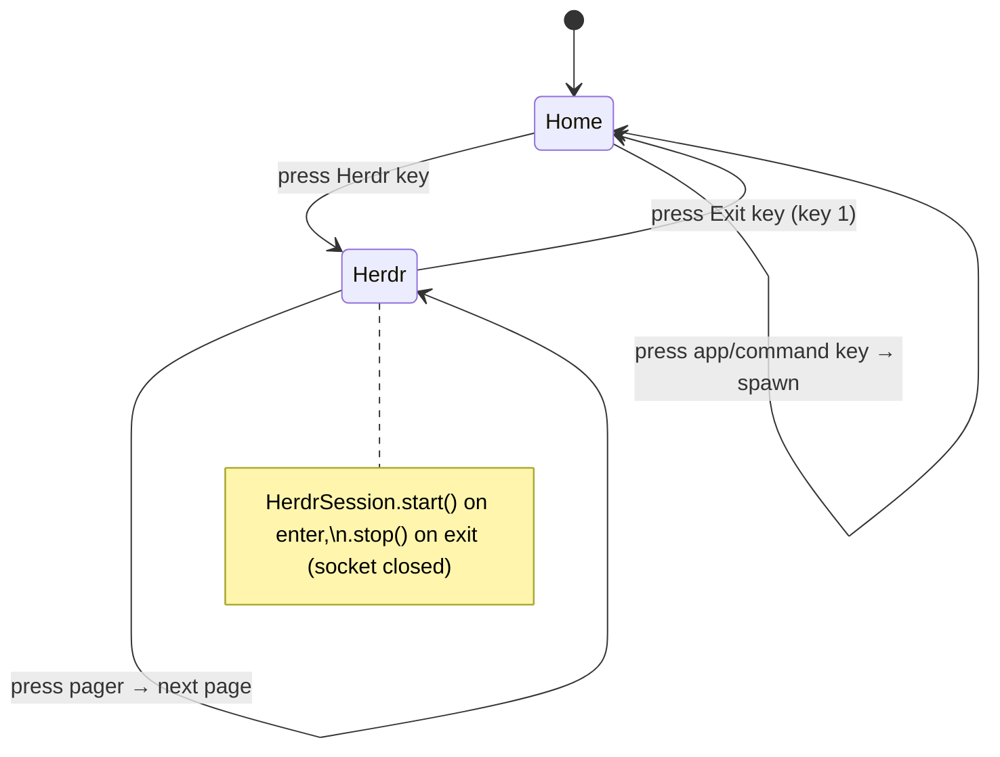
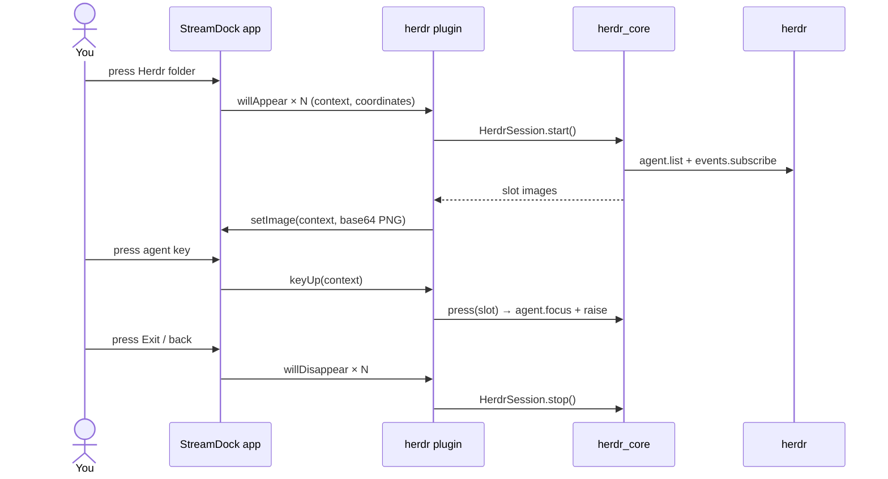
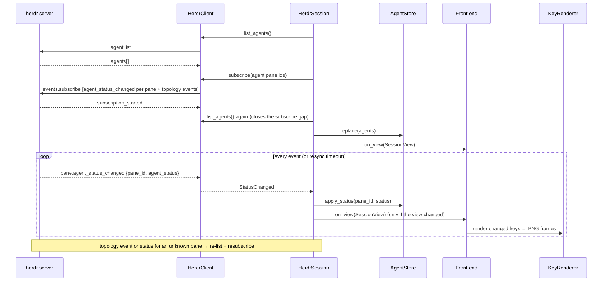
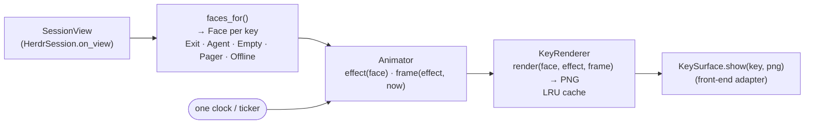
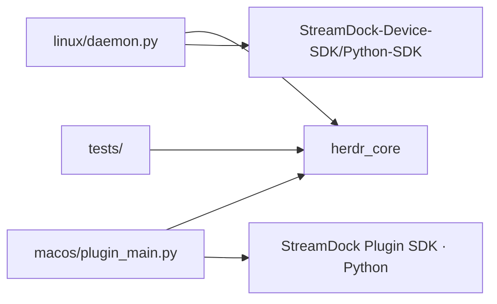

# herdr-dock — design

Show every herdr coding agent as a key on a StreamDock **M18**, recolour the key
live as the agent's status changes, and press a key to jump to that agent.
The agent keys appear only in **Herdr mode**. One Herdr button enters the mode, and one Exit
button leaves it.

Platforms: **Linux** (our own daemon on the Device SDK) and **macOS** (a plugin for the
official StreamDock app). Both use the same herdr core.

## Engineering rules

These rules are binding for all code in this repo. A change that breaks one isn't finished.

### Testing: at least 80 % coverage

- `pytest` + `pytest-cov` + `pytest-asyncio`. Coverage is measured on **our** packages
  (`herdr_core`, `linux`, `macos`) with branch coverage on. Vendored SDKs are excluded.
- The gate is in `pyproject.toml` (`[tool.coverage.report] fail_under = 80`), so
  `pytest --cov` fails below 80 %. `herdr_core` should aim for 90 % or more, because it holds the logic.
- Every behaviour change ships with tests in the same change. Bug fixes start with a
  failing test that reproduces the bug.
- No real hardware, herdr server, StreamDock app or OS window manager in unit tests.
  They talk to fakes:
  - `tests/fakes/herdr_server.py` `FakeHerdrServer`: an asyncio Unix-socket server that speaks
    the real NDJSON protocol, scripts events, injects errors and records requests.
  - `tests/fakes/in_memory.py` `InMemoryHerdr` (HerdrApi + HerdrEventSource without I/O) and
    `RecordingRaiser`.
  - `tests/fakes/surface.py` `FakeSurface` (records key images, can fail keys) and `FakeClock`.
  - `tests/fakes/sdk.py` `FakeSdk` / `FakeSdkDevice`: the vendor M18 SDK, including raw key
    packets, open/init failures and `close(notify=…)`.
  - Subprocess-based adapters (`hyprctl`, `dbus-monitor`, `systemd-inhibit`, `notify-send`) take
    an injectable runner or spawner, and tests pass fakes. No real WM or D-Bus is touched.
- Hardware/app adapters stay thin (they only translate calls). They're covered by a small set of
  **opt-in integration tests** (`pytest -m hardware`, `pytest -m herdr_live`) that are skipped by default.
- `# pragma: no cover` only on code that can't run in CI (for example a platform-specific `if`
  branch), and each one needs a one-line reason next to it.
- Tests are fast (the full unit suite runs in under 10 s) and deterministic: no sleeps and no network.

### Design: SOLID

| Principle | How it applies here |
|-----------|---------------------|
| **S**ingle responsibility | One reason to change per class: `HerdrSocketClient` = protocol/transport, `AgentStore` = state + slot assignment, `paginate()` = paging, `faces_for()` = what a key shows, `Animator` = timing, `KeyRenderer` = pixels, `DeckPresenter` = what to send when, `HerdrSession` = orchestration only. On Linux: `M18Device` = hardware, `DockController` = modes and presses, `Daemon` = tasks and queue, widgets = one live key each, `LockMonitor`/`SleepMonitor` = power state. |
| **O**pen/closed | Statuses, glyphs and colours come from data (`theme.py`, `[colors]`), not `if` chains. New front ends (another device, Windows) are new adapters, with no edits to `herdr_core`. New live home keys are new widget classes (`face`/`press`/`advance`) plus one line in `build_widgets()`. The controller doesn't change. |
| **L**iskov substitution | Every implementation of a port must pass the same **contract test suite** (`tests/contracts/test_herdr_ports_contract.py`). `InMemoryHerdr` and `HerdrSocketClient` + `FakeHerdrServer` run the same tests, so session tests on the in-memory fake are valid for the real client. |
| **I**nterface segregation | Small `typing.Protocol` ports instead of one big interface: `HerdrApi` (list/focus), `HerdrEventSource` + `EventStream` (subscribe), `KeySurface` (`show(key, png)`), `Raiser`, `Clock`, `Sleep`. Key input reaches the core as plain `press(index)` calls from the front end. Consumers depend only on what they use. |
| **D**ependency inversion | `herdr_core` depends on those Protocols, never on the StreamDock SDK, the plugin SDK, `subprocess`, sockets or `time` directly. Concrete adapters are wired up in one composition root per front end (`linux/daemon.py`, `macos/plugin_main.py`). |

### Code conventions

- Python ≥ 3.11, fully type-annotated, `mypy --strict` clean on `herdr_core` **and** `linux`
  (the vendor SDK is untyped and excluded). `ruff` for lint and format (line length 100;
  `×` is allowed as a confusable, because it's herdr's glyph).
- Immutable value objects (`@dataclass(frozen=True, slots=True)`) for `Agent`, `SessionView`,
  `PageView`, every `Face`, `Config` and `HomeKey`.
  The store returns new snapshots instead of objects that change underneath you.
- asyncio for all I/O in the core. Blocking SDK calls run in the adapter's worker thread, never on
  the event loop.
- No global state or singletons. Configuration is passed in explicitly.
- Errors at boundaries are typed (`HerdrUnavailable`, `HerdrRequestError`, `HerdrProtocolError`,
  `DeviceError`, `DevicePermissionError`, `ConfigError`) and handled where recovery is decided
  (the session, daemon or controller), not swallowed in adapters.
- OS access in the core has injectable defaults only: `run_shell` (raise commands),
  `read_herdr_status` (`herdr status server`), `time.monotonic` and `asyncio.sleep`. Tests always
  inject.
- Nothing the user can trigger may crash the daemon: every background loop (device watcher,
  input handler, widget ticks, weather, lock/sleep monitors) catches, logs once, and keeps going.
- Logging through `logging`, one logger per module, with no `print` outside CLI entry points.

## Decisions

| Topic            | Decision |
|------------------|----------|
| Device           | StreamDock M18: 15 LCD keys (3×5), 64×64 JPEG; animation = host-side frame swaps |
| Shared core      | `herdr_core` Python package: herdr socket client, agent store, paging, key renderer, focus + raise |
| Linux front end  | Our own daemon on `StreamDock-Device-SDK/Python-SDK`, with a TOML-defined home page (apps, commands, Herdr key) |
| macOS front end  | StreamDock app plugin (`.sdPlugin`) built with the official Python plugin SDK and packaged with PyInstaller |
| herdr transport  | Native socket API (NDJSON over Unix socket); no herdr plugin SDK required |
| Scope            | All agents in all workspaces of the default herdr session |
| Mode             | One Herdr button enters Herdr mode, one Exit button leaves it. herdr is connected **only while in Herdr mode** |
| Key press        | `agent.focus` in herdr **and** raise the terminal window; the raise command is set in config for each OS |
| Overflow         | Pager key when agents exceed the free keys |
| Raise (Linux)    | Default `herdr-window`: focus the Hyprland window whose process owns the herdr client (`/proc` parent walk); any terminal works |
| Home page (Linux) | TOML `[[home]]` keys: `herdr`, `app`, `run`, optional `focus` (focus a running window instead of launching), and live `widget`s (clock, weather, pomodoro, timer) |
| Weather          | Open-Meteo (free, no API key); location, units and refresh interval in the config |
| Lock / sleep     | Dock off while the session is locked (Hyprland session-lock flag) or the machine sleeps (logind `PrepareForSleep` plus a delay inhibitor) |
| Device access    | udev `uaccess` rule for the M18 IDs only (not the SDK's world-writable rule) |
| Autostart        | systemd **user** service bound to `graphical-session.target` |

## Overview



The front ends only map **physical keys ↔ slots** and push images. Everything to do with
herdr lives in the core.

## Herdr mode: one button in, one button out

### Key layout in Herdr mode (M18, 3×5, logical keys)

| | col 1 | col 2 | col 3 | col 4 | col 5 |
|---|:---:|:---:|:---:|:---:|:---:|
| **row 1** | **◀ Exit** (key 1) | A1 (key 2) | A2 (key 3) | A3 (key 4) | A4 (key 5) |
| **row 2** | A5 (key 6) | A6 (key 7) | A7 (key 8) | A8 (key 9) | A9 (key 10) |
| **row 3** | A10 (key 11) | A11 (key 12) | A12 (key 13) | A13 (key 14) | A14 **or** Pager `1/2 ▶` (key 15) |

- key 1: Exit Herdr mode (always)
- keys 2–14: agent slots (13 per page when paging)
- key 15: agent slot A14 when everything fits, or the pager when agents > 14

- **Exit** is always on key 1. It shows `◀ herdr` and a mini summary, for example a red dot
  if any agent is blocked.
- With up to 14 agents there is no pager. With 15 or more, key 15 becomes the pager: it shows
  `1/2 ▶` plus coloured dots for the statuses on the other pages, so an off-screen
  `blocked` agent is still visible.
- On Linux, the M18's extra non-LCD inputs (logical keys 16–18, if present) can also act
  as Exit and Pager.

### Linux



The daemon owns the whole device, so the Exit key is ours. Entering Herdr mode calls
`HerdrSession.start()`, and Exit calls `.stop()`, which closes the subscription and drops
the herdr connection. Then the daemon redraws the home page.

### macOS

The StreamDock app owns the pages, and the plugin SDK has **no command to switch pages or
profiles** (open request:
[StreamDock-Plugin-SDK#33](https://github.com/MiraboxSpace/StreamDock-Plugin-SDK/issues/33)).
So on the Mac:

- **Herdr button** = a normal **folder** you create in the StreamDock app.
- **Exit button** = the app's own folder back key. Verified: the app puts a **fixed** back key on
  key 1 of every folder, and a plugin can't replace or move it. So there is no Exit action, and the
  `ExitFace` status summary isn't shown on macOS (`KeyLayout(exit_key=True)`: key 1 is the app's).
- Keys 2–15 inside the folder hold **"Herdr Agent Slot"** actions, and key 15 can hold the
  **"Herdr Pager"** action instead.
- Lifecycle comes from visibility: the first `willAppear` of any plugin action calls
  `HerdrSession.start()`, and when the last one gets `willDisappear` the plugin calls `.stop()`.
  Nothing talks to herdr while you're outside the folder.



## herdr_core

### Status-change flow (both platforms)



### Front-end interface

Implemented in `herdr_core/session.py`. The session publishes a **view model**. It doesn't render
pixels, so rendering (milestone 2) stays a separate responsibility that front ends compose
with it.

```python
class HerdrSession:
    def __init__(self, api: HerdrApi, events: HerdrEventSource, raiser: Raiser, *,
                 capacity: int,                      # keys available for agents + pager
                 on_view: Callable[[SessionView], None],
                 resync_interval: float = 30.0, backoff: Backoff | None = None,
                 sleep: Sleep = asyncio.sleep): ...
    async def start(self) -> None: ...   # connect, list, subscribe, follow events
    async def stop(self) -> None: ...    # close stream, cancel task, emit offline view
    async def press(self, key_index: int) -> None: ...  # agent → focus+raise; pager → next page
    def next_page(self) -> None: ...

@dataclass(frozen=True)
class SessionView:
    connected: bool
    page: PageView              # agents on this page (None = empty key), has_pager, offpage_statuses
    total_agents: int
    statuses: frozenset[AgentStatus]   # across all agents, for the Exit key summary
```

`on_view` fires only when the view actually changes. Key index 0 is the first agent key, and
index `capacity - 1` is the pager when one is shown.

Slot numbering is logical (0..n), and each front end maps it to physical keys:
- Linux: the daemon maps logical keys 2..15 to slot indexes.
- macOS: the plugin derives the slot from the `coordinates` (row, column) in the
  `willAppear` payload. A "slot #" setting in the Property Inspector is the fallback.

### herdr API facts (verified against herdr 0.8.2, protocol 20)

- Socket: `herdr status server` prints the path (`~/.config/herdr/herdr.sock` here). The core
  resolves the path in this order: config value, then the `HERDR_SOCKET` env var, then the
  `herdr status server` output, then the default path. On macOS the StreamDock app starts
  the plugin with a minimal `PATH`, so the plugin must also search `/opt/homebrew/bin`
  and `/usr/local/bin` for `herdr` (milestone 5; not implemented yet).
- Framing: one JSON object per line. Request: `{"id","method","params"}`. Response:
  `{"id","result"}`, or an error.
- Ordinary requests: the server closes the connection after replying. Open a new
  connection for each RPC.
- `events.subscribe` keeps the connection open. The server first replies `subscription_started`,
  then sends `{"event": "...", "data": {...}}` lines.
- `pane.agent_status_changed` subscriptions **require `pane_id`**, so the core
  resubscribes whenever the set of agent panes changes.
- Statuses: `idle`, `working`, `blocked`, `done`, `unknown`. `done` means the agent
  finished background work that hasn't been seen yet. Focusing the agent marks it seen and it
  becomes `idle`.
- `agent.list` fields used: `pane_id`, `workspace_id`, `tab_id`, `agent`, `agent_status`,
  `cwd`, `terminal_title_stripped`, `focused`.
- Focus: `agent.focus {"target": "<pane_id>"}`. Unknown targets return the error
  `{"code": "agent_not_found"}`. Focusing turns `done` into `idle` and emits `pane_focused`.
- Request `id` **must be a string**. A numeric id gets `invalid_request`.
- Event names are mixed: `pane.agent_status_changed` (dot), but `pane_created`, `pane_closed`,
  `pane_agent_detected`, `pane_focused`, `workspace_closed` (underscore). The parser
  normalises dots to underscores.
- Closing a workspace emits only `workspace_closed`, with no `pane_closed` for its panes. Any
  topology event (pane/tab/workspace created, closed, moved, agent detected or released) triggers a full
  resync, so this case is covered too.
- An agent going `blocked` → `idle` while unseen is reported as `done`.
- **`pane_focused` events are not the current focus.** A new `events.subscribe` stream gets a
  replay of recent focus changes (about 10/s, across tabs), while `agent.list` stays steady.
  The session treats focus events only as a hint and re-reads focus from `agent.list`, at most
  every 0.5 s (`focus_refresh_interval`). Without this, the focus border flickered across agents
  each time Herdr mode was entered.
- `pane.report_agent` drives agent states in a throwaway session. The live integration tests
  (`tests/integration/test_herdr_live.py`) use it against `herdr --session <tmp> server`.

### Key appearance (64×64)

Symbols and colour roles match herdr's sidebar with `status_indicators = "symbols"`
(herdr source, `src/client/shell.rs`: `status_icon` and `status_color`). An agent looks the
same on the dock as in herdr.

| Status   | herdr symbol | herdr colour role | Default colour | Key style | Animation |
|----------|:-----:|-------------|-----------|-----------|-----------|
| blocked  | `×`   | red         | `#e64553` | filled    | **Blink**: full red ↔ dark key with red `×` (2 Hz) |
| done     | `✓`   | teal        | `#179299` | filled    | **Pulse** (opt-in via `attention`): full ↔ dimmed (0.7 Hz) |
| working  | `◐`   | yellow      | `#df8e1d` | filled    | **Spinner**: `◐ ◓ ◑ ◒` (4 frames/s) |
| idle     | `○`   | green       | `#40a02b` | dark key, green symbol | static |
| unknown  | `·`   | overlay0    | `#7c7f93` | dark key, gray symbol  | static |
| focused  | —     | —           | `#ffffff` | 2 px white border on top of any state | static |
| empty    | —     | —           | black     | blank | static |
| offline  | —     | —           | black     | muted `herdr` / `offline` | static |

The **Exit** key shows `◀ herdr` plus one dot per status present, most urgent first. The
**pager** shows `▶ 1/3` plus dots for the statuses on other pages. Both blink red when a
blocked agent is in their scope, or pulse when only `done` is (with `done` in `attention`).

- Idle and unknown keys are dark, with only the symbol coloured, so quiet agents stay quiet and
  full-colour keys always mean something is happening. This is a change from the first draft,
  which filled idle keys green.
- **Needs attention** means `blocked`, which always blinks. Adding `done` to
  `attention = ["blocked", "done"]` makes unseen finished work pulse. Pressing the key focuses
  the agent, herdr marks it seen (done becomes idle), and the animation stops by itself.
- Layout: the agent kind (`claude`, `codex`, …) at the top, the large status symbol in the
  centre, and the label at the bottom, ellipsised to fit. Text is dark or light depending on
  the background's luminance. `label = "cwd" | "title" | "name"`.
- Colours: `[colors]` in config overrides any status colour (`blocked = "#ff0000"`).
- Fonts are bundled in `herdr_core/fonts/`: **DejaVu Sans** for the symbols and **DejaVu Sans
  Condensed Bold** for the text, with the DejaVu licence. They cover `× ✓ ◐ ◓ ◑ ◒ ○ · ▶ ◀ …`,
  so keys look identical on Linux and macOS.
- `scripts/render-preview.sh` writes every face and frame plus `sheet.png` to `build/preview/`.

### Rendering pipeline



- `faces.py`: `SessionView` → immutable `Face` values (what to show, no pixels).
  `KeyLayout` maps physical keys: with `exit_key`, key 0 is Exit and keys 1.. are session keys.
- `animation.py`: `Animator` decides each face's `Effect` (none/spin/blink/pulse) and its frame
  as a pure function of time.
- `render.py`: `KeyRenderer` draws `(face, effect, frame)` to PNG bytes at any size (64 px for the
  M18, larger for the macOS app) and caches them.
- `presenter.py`: `DeckPresenter` is the session's `on_view` target. It sends only keys whose
  `(face, effect, frame)` changed to a `KeySurface`, and runs the ticker only while something is
  animated. `invalidate()` redraws everything after a device replug.

### Animation: how it works

There's no on-device animation. Both platforms swap static frames from the host:

- **macOS app:** animated icons you set by hand in the StreamDock app are GIFs that the
  app plays frame by frame. A plugin gets the same effect by calling `setImage` repeatedly.
- **Linux SDK:** `set_key_gif` and `GifController` also stream frames from the host.

So `herdr_core` owns one ticker, in `DeckPresenter`:

- Frames are rendered once and cached by `(face, effect, frame)`, so a tick mostly re-sends
  cached bytes.
- The ticker wakes every `1 / max(spinner_fps, 2·blink_hz, 2·pulse_hz)` seconds (0.25 s by
  default). Each key's frame comes from the same clock reading, so blinks stay in phase.
- Only keys whose frame actually changed are sent. With nothing animated there is no ticker at
  all, and nothing ticks outside Herdr mode, because the presenter is stopped there.
- Config: `animate = true`, `blink_hz = 2`, `spinner_fps = 4`, `pulse_hz = 0.7`,
  `attention = ["blocked"]`. If the device or app can't keep up (see Open items), lower
  `spinner_fps` or set `animate = false`.

### Ordering & paging

- Ordering is stable: workspace order, then tab, then pane. An agent keeps its slot until it
  exits, and new agents fill gaps instead of reshuffling the other keys.
- Page size = number of agent slots (14 without a pager, 13 with one). The pager cycles
  through the pages, and the current page is remembered while you stay in Herdr mode.

### Window raising (configurable)

Each OS has its own command template in config, with `{pane_id}`, `{workspace_id}` and `{cwd}`
filled in:

```toml
[raise]
enabled = true
linux = "hyprctl dispatch focuswindow class:com.mitchellh.ghostty"
macos = "osascript -e 'tell application \"Ghostty\" to activate'"
```

Example presets will be documented for Ghostty, Alacritty, Kitty, iTerm2 and Terminal.app.

## Linux front end: `herdr-dock` daemon

Run it with `scripts/run-linux.sh`. Configure it by copying `config.example.toml` to
`~/.config/herdr-dock/config.toml`; every setting is documented there.

```mermaid
flowchart LR
    m18[["M18"]] -->|raw HID packets| dev["M18Device<br/>(worker thread)"]
    dev -->|KeyPressed / ButtonPressed| daemon["Daemon<br/>input queue · replug watcher"]
    daemon --> ctl["DockController<br/>HOME ⇄ HERDR"]
    ctl -->|HOME| launcher["ShellLauncher<br/>run / app"]
    ctl -->|HERDR| session["HerdrSession"]
    session -->|SessionView| presenter["DeckPresenter"]
    presenter -->|show(key, png)| dev
    ctl -->|home faces| dev
    session -->|focus| herdr[("herdr")]
    session -->|raise| raiser["HerdrWindowRaiser<br/>hyprctl"]
```

| Module | Responsibility |
|--------|----------------|
| `linux/device.py` | `M18Device` (a `KeySurface`): finds the M18 by configured IDs, checks access, drives the vendor SDK on one worker thread, decodes raw presses |
| `linux/controller.py` | `DockController`: modes. HOME draws launcher keys and launches. HERDR runs session + presenter, with Exit on key 0. Extra buttons map to actions |
| `linux/launcher.py` | `ShellLauncher`: detached `run` commands and `app` launches (`uwsm-app -- {app}`) |
| `linux/widgets.py` | Live home keys sharing `face()`/`press()`/`advance()`: `ClockWidget`, `WeatherWidget` (Open-Meteo, keeps the last reading on failure), `PomodoroWidget` (work/rest cycle computed from the start time, notifies on phase change) and `TimerWidget` (stopwatch) |
| `linux/service.py` | Renders the systemd unit (quoted `ExecStart`, `%` escaped) |
| `linux/power.py` | `LockMonitor` (Hyprland session lock via `hyprctl -j monitors`) and `SleepMonitor` (logind `PrepareForSleep` via `dbus-monitor`) |
| `linux/hyprland.py` | `HerdrWindowRaiser`: focuses the window hosting the herdr client (walks `/proc` parents to a `hyprctl clients` pid) |
| `linux/config.py` | `[linux]`, `[linux.buttons]` and `[[home]]` settings |
| `linux/daemon.py` | Composition root, input queue, replug watcher, signal handling, clean shutdown (keys cleared) |
| `linux/70-herdr-dock.rules` | udev `uaccess` rule for the M18 IDs (`scripts/install-linux.sh --udev`) |
| `linux/herdr-dock.service` | systemd user unit template (`scripts/install-linux.sh`) |
| `tools/probe_m18.py` | Hardware probe: IDs, firmware, key codes, update speed |

**Modes**
- **HOME**: `[[home]]` keys (`herdr = true`, `app = …`, `run = …`, with an optional `symbol` or
  `icon`). Nothing talks to herdr. The default home page is a single `◐ herdr` key on key 1.
  `focus = "<class regex>"` first focuses the most recently used Hyprland window whose class
  matches, and only launches `app`/`run` when there is none (`WindowFocuser`).
  `widget = "clock" | "weather"` keys are live. The daemon queues a tick every second, and
  `DockController.tick()` redraws home keys whose face changed. Weather refreshes every
  `refresh_minutes` (retrying after 60 s on failure) and also queues a tick. Ticks, redraws and
  presses share one queue, so they never interleave. The weather fetch is the daemon's only
  network access.
  Pressable widgets (pomodoro, timer) take the press and redraw their key at once. Every tick
  calls `advance()` on all widgets, even in Herdr mode, so pomodoro phase notifications aren't
  missed. Phases are a pure function of `monotonic() - start`, so no timers drift.
- **HERDR**: key 1 = Exit (`◀ herdr` + status dots), keys 2–15 = agents (key 15 = pager on
  overflow). Entering starts presenter + session. Exit stops the presenter first, so the
  session's final "offline" view never reaches the keys, then the session, then redraws home.
- **Extra buttons** (default): left = enter/leave Herdr mode, middle = none, right = next page.

**M18 facts (verified on the unit, firmware `V3.VSDM18_HBOE.02.017`)**
- USB `5548:1000` "HOTSPOTEKUSB HID DEMO" (VSDinside-branded M18). It is **not** in the SDK's
  `g_products`, so the daemon enumerates the configured IDs itself (`linux.device_ids`).
- Physical key index 0 = top-left, left to right, top to bottom. **Images**:
  `set_key_image(index + 1)`. **Presses**: raw code `index + 1` (bytes `ACK..OK`, `data[9]` code,
  `data[10]` 1 = press, 0 = release). The SDK's *decoded* key numbers are wrong for presses
  (raw 1 is reported as KEY_11), so the daemon decodes raw packets.
- Extra buttons: raw `0x25` (left), `0x30` (middle), `0x31` (right).
- Speed: all 15 keys plus refresh in about 10–13 ms, one key in about 1 ms. Animation is not a concern.
- Without device permissions the SDK **still reports success** from `open()` and
  `set_key_image()`. `M18Device` checks `os.access()` on the hidraw path first and logs a hint
  to install the udev rule.
- The SDK writes temporary JPEGs into the current directory, so the daemon `chdir`s to
  `$XDG_RUNTIME_DIR/herdr-dock`.
- Replug: the daemon polls presence every `poll_seconds` (2 s), reconnects, and redraws the current mode.

**Lock and sleep**: the daemon turns the dock off while the session is locked
(`blank_when_locked`) or the machine sleeps (`blank_on_sleep`).
- **Lock:** Hyprland exposes no lock event, but an active ext-session-lock adds `LOCK` to every
  monitor's `solitaryBlockedBy` (the same signal Omarchy's `omarchy-hyprland-session-locked`
  uses). It's polled every `lock_poll_seconds`, and it works with any ext-session-lock locker. While
  `hyprctl` fails, the last known state is kept and polling backs off up to 30 s. It never
  guesses "unlocked".
- **Sleep:** logind's `PrepareForSleep(true/false)`, streamed from
  `dbus-monitor --system`. While awake the daemon holds a logind **delay inhibitor**
  (`systemd-inhibit --what=sleep --mode=delay … sleep infinity`). On `PrepareForSleep(true)` it
  waits until the dock is actually dark (at most 3 s), then releases the inhibitor, and it takes
  it again on resume. `systemd-inhibit --list` shows it as `herdr-dock`. Omarchy also locks
  before suspending, so both signals usually agree.
- **Off** means `set_brightness(0)` plus cleared keys. The off state is remembered across
  reconnects (a resume often re-enumerates USB). While off, presses are ignored, home ticks are
  skipped and the Herdr-mode presenter is stopped. **On** restores brightness and fully redraws the
  current mode.
- Lock/sleep changes go through the input queue like everything else. If `hyprctl` or
  `dbus-monitor` is unavailable, that monitor logs once and stops; the rest keeps working.

**Raise**: `[raise] linux = "herdr-window"` (the default) focuses the terminal the herdr client
runs in, whichever terminal that is, using Hyprland ≥ 0.55 Lua dispatch
(`hl.dsp.focus({ window = "address:…" })`) with the old `focuswindow` syntax as a fallback. Any
other value is a shell command template.

## macOS front end: `com.herdr.dock.sdPlugin`

- Built on the official Python plugin SDK (`SDPythonSDK`: WebSocket client, Action
  classes, PyInstaller spec). It is packaged as a single executable named in the manifest's
  `CodePathMac` (the app also reads `CodePathWin`), with `herdr_core` bundled in.
- Manifest actions:

  | UUID | Name | Behaviour |
  |------|------|-----------|
  | `com.herdr.dock.slot`  | Herdr Agent Slot | Shows agent N of the current page; press → focus + raise |
  | `com.herdr.dock.pager` | Herdr Pager      | `1/2 ▶`, cycles pages |

- Events used: `willAppear`, `willDisappear`, `keyUp`, `didReceiveSettings`. Commands used:
  `setImage` (base64 PNG) and `setTitle` (empty, because the image already has the text).
- Lifecycle: a reference count of visible plugin contexts. Going from 0 to 1 calls `start()`, and going from 1 to 0 calls `stop()`.
- The `raise.macos` command still applies. The StreamDock app itself doesn't take focus
  when a key is pressed.
- Install: copy the `.sdPlugin` folder into the StreamDock plugins directory and restart the
  app. Then create a folder named "Herdr" and drag the actions onto keys 1–15.
- Using the Device SDK daemon on macOS is still possible, but it can't run alongside the
  StreamDock app because only one can hold the device. That's why the plugin is the macOS route.

## Project layout

| Path | Purpose |
|------|---------|
| `README.md` | User guide: setup, configuration, service, troubleshooting |
| `DESIGN.md` | This document: architecture, decisions, verified facts, milestones, open items |
| `CHANGELOG.md` | What was built, in order, and what was learned |
| `CLAUDE.md` | Working agreements and current state for AI-assisted sessions (loaded automatically) |
| `config.example.toml` | Every setting, documented. **Mirrors the author's own config** |
| `pyproject.toml` | Package metadata, dependencies and extras (`dev`, `linux`, `macos`), pytest/coverage/ruff/mypy config |
| **herdr_core/** | Shared, platform-independent |
| `herdr_core/models.py`, `errors.py`, `events.py` | `Agent`/`AgentStatus`, typed errors, typed events + parser |
| `herdr_core/ports.py` | `typing.Protocol` ports: `HerdrApi`, `HerdrEventSource`, `EventStream`, `KeySurface`, `Raiser`, `Clock`, `Sleep` |
| `herdr_core/client.py` | `HerdrSocketClient`: socket RPC + subscription stream |
| `herdr_core/socket_path.py` | Socket discovery (config → `$HERDR_SOCKET` → `herdr status server` → default) |
| `herdr_core/store.py`, `paging.py`, `backoff.py` | Stable key slots, page layout, reconnect delays |
| `herdr_core/session.py` | `HerdrSession`: list → subscribe → follow, focus/raise on press, emits `SessionView` |
| `herdr_core/faces.py` | Per-key `Face` values (agent, exit, pager, empty, offline, launcher, clock, weather, pomodoro, timer) and `KeyLayout` |
| `herdr_core/animation.py` | `Animator` (blink/spin/pulse as a function of time), `AnimationConfig` |
| `herdr_core/theme.py` | herdr status glyphs, priority order, and widget glyphs and colours (Catppuccin) |
| `herdr_core/render.py` | `KeyRenderer`: Pillow, any key size, LRU PNG cache, drawn tomato/stopwatch icons |
| `herdr_core/presenter.py` | `DeckPresenter`: sends changed keys to a `KeySurface`, animation ticker, retries failed keys |
| `herdr_core/raise_window.py` | `CommandRaiser` (shell template) / `NullRaiser` |
| `herdr_core/config.py` | Core settings (`herdr_socket`, `label`, `resync_seconds`, `[raise]`, animation, `[colors]`) |
| `herdr_core/console.py`, `preview.py` | `scripts/run-console.sh`, `scripts/render-preview.sh` |
| `herdr_core/fonts/` | DejaVu Sans + DejaVu Sans Condensed Bold, with licence |
| **linux/** | Linux front end |
| `linux/daemon.py` | Composition root: `build()`, `Daemon` (input queue, device watcher, widget/weather/power tasks), `main()` |
| `linux/controller.py` | `DockController`: HOME/HERDR modes, presses, buttons, blanking |
| `linux/device.py` | `M18Device` + `StreamDockSdk` adapter: worker thread, access check, raw press decoding, unplug safety |
| `linux/config.py` | `[linux]`, `[linux.buttons]`, `[[home]]` (incl. widget options) |
| `linux/widgets.py` | `ClockWidget`, `WeatherWidget`, `PomodoroWidget`, `TimerWidget`, `desktop_notify` |
| `linux/hyprland.py` | `hyprctl` helpers, `HerdrWindowRaiser`, `WindowFocuser` |
| `linux/power.py` | `LockMonitor`, `SleepMonitor` (+ delay inhibitor) |
| `linux/launcher.py` | `ShellLauncher` (`run`, `app` via `uwsm-app`) |
| `linux/service.py`, `linux/herdr-dock.service` | systemd unit template and renderer |
| `linux/70-herdr-dock.rules` | udev `uaccess` rule for the M18 |
| **macos/** | macOS front end: **not built yet** (milestone 5). Planned: `com.herdr.dock.sdPlugin/` (`manifest.json`, `static/img/`, `propertyInspector/`), `plugin_main.py`, `plugin.spec` |
| **scripts/** | `setup`, `check`, `test`, `test-integration`, `lint`, `format`, `run-console`, `render-preview`, `run-linux`, `install-linux`, `build-macos-plugin`, `install-macos-plugin` (see README) |
| `tools/probe_m18.py` | Hardware probe: IDs, firmware, raw key codes, update speed |
| `tests/unit/` | Fast unit tests (core and `tests/unit/linux/`) |
| `tests/contracts/` | Port contract suite run against every implementation |
| `tests/fakes/` | `FakeHerdrServer`, `InMemoryHerdr`, `RecordingRaiser`, `FakeSurface`, `FakeClock`, `FakeSdk` |
| `tests/integration/` | Opt-in: `herdr_live` (throwaway headless herdr) and `hardware` (the M18) |



## Resilience

| Failure | Handling |
|---------|----------|
| herdr not running / restarted | Exponential backoff reconnect (0.5 s → 10 s), keys show offline, full resync on reconnect |
| Missed events | Periodic `agent.list` resync every `resync_seconds` while in Herdr mode |
| Device absent at start (Linux) | Daemon runs normally and logs "waiting for the M18" once. It polls every `poll_seconds` and draws the current mode when the dock appears |
| Device unplugged mid-run (Linux) | The hidraw node is checked every 0.25 s and before **every** write. On removal the device is closed *without* the SDK's disconnect write (writing to a removed device can kill the process natively), and later key updates are dropped. On replug: reconnect, then redraw the current mode. Verified on the M18 while animating: same PID, no restart, clean log |
| Device or SDK errors | The watcher never dies: errors are logged once per distinct message. Presenter draw failures are logged once per failure streak and retried on the next push |
| StreamDock app restarts (macOS) | Plugin process restarts. Contexts reappear through `willAppear` and the session restarts |
| Rapid status flapping | No debounce: only keys whose `(face, effect, frame)` changed are sent, and a key update costs about 1 ms on the M18 |
| Weather fetch fails / offline | Keep the last reading (or `--`), log once, retry after 60 s |
| `hyprctl` unavailable | Raise/focus fall back to "no window" (apps still launch). The lock monitor keeps its last state and backs off, and never guesses "unlocked" |
| `dbus-monitor` / `systemd-inhibit` unavailable | Sleep blanking off, or without the delay lock, with one log line |
| Locked while a key is pressed | Presses are ignored while the dock is off |
| Leaving Herdr mode mid-request | `stop()` cancels in-flight tasks. Late events are ignored |

## Milestones

1. ✅ **herdr_core**: client, store, paging, session, raiser, config, and a console printer
   (`scripts/run-console.sh`). Tests use a fake socket server, in-memory fakes, shared port
   contracts and live tests against a throwaway herdr session. 99 % branch coverage.
2. ✅ **Rendering**: faces, animator, Pillow renderer with bundled fonts, `DeckPresenter`
   with one in-phase ticker, `[colors]`/animation config, and `scripts/render-preview.sh`.
3. ✅ **Linux daemon**: home page from TOML (run/app/herdr keys), Herdr mode with Exit on key 1,
   agent keys, focus + raise of the herdr window (Hyprland), extra buttons, replug handling,
   uaccess udev rule, hardware probe. Verified on the M18.
4. ✅ **Linux service**: systemd `--user` unit (`linux/herdr-dock.service`, bound to
   `graphical-session.target`, restarts on failure) installed by `scripts/install-linux.sh`.
   Home keys can also `focus = "<class regex>"` an existing Hyprland window before launching.
5. **macOS plugin** (not started): manifest, slot/pager/exit actions, visibility lifecycle,
   PyInstaller build, install + folder setup guide. Start by resolving the macOS open items below
   on the Mac.

After milestone 4 (all on Linux, all verified on the M18 unless noted):

- Unplug-safe device handling, focus-or-launch home keys, `focus_herdr_on_enter`.
- Three code reviews, every finding fixed with a regression test (see CHANGELOG).
- Clock and weather widgets, with colours.
- Dock off on lock (verified) and sleep (unit-tested; **not yet verified through a real
  suspend**).
- Pomodoro and timer widgets.

## Open items

- **Suspend/resume on hardware**: confirm the dock goes dark before suspend and comes back
  after resume (`journalctl --user -u herdr-dock` should show "system going to sleep" /
  "system resumed"). The delay inhibitor is held (`systemd-inhibit --list` shows `herdr-dock`).
- ✅ **M18 hardware**: `5548:1000`, 3 extra buttons (`0x25/0x30/0x31`). Key mapping verified.
  See "M18 facts" above.
- ✅ **macOS Exit key** (spike, VSD Craft 3.10.205): every folder gets a **fixed** back key on
  key 1 that a plugin can't replace. The plugin has no Exit action. A plugin still can't go
  back itself until the SDK adds page switching (#33).
- ✅ **macOS slot mapping**: `willAppear`/`willDisappear`/`keyDown`/`keyUp` carry
  `payload.coordinates {column, row}` (0-based, top-left origin). The M18 is 5 × 3, so
  key index = `row * 5 + column`. No "slot #" setting is needed.
- ✅ **macOS plugin directory**: `~/Library/Application Support/HotSpot/StreamDock/plugins/`.
- ✅ **macOS launch**: `CodePathMac` can be a script or executable. The app runs it with
  `-port -pluginUUID -registerEvent -info`, cwd = the plugin folder, as the user, with
  `PATH=/usr/bin:/bin:/usr/sbin:/sbin;/Applications/VSD Craft.app/Contents/MacOS`. So the plugin
  must search for `herdr` itself (`~/.local/bin`, `/opt/homebrew/bin`, `/usr/local/bin`).
- ✅ **macOS lifecycle**: opening a folder sends `willDisappear` for the page's keys and then
  `willAppear` for the folder's keys (new contexts). Leaving does the reverse. Dragging a key
  keeps its context and sends `willDisappear` + `willAppear` with the new coordinates. A page
  switch can drop the visible count to 0 for an instant, so the plugin waits about 0.3 s before
  stopping the session.
- ✅ **macOS images**: 64 × 64 PNG data URLs through `setImage` display sharp.
- The `info` argument lists several device types and every event carries a `device` id. The
  plugin only drives the 5 × 3 device.
- ✅ **Animation rate on Linux**: about 1 ms per key, so not a concern.
- **Animation rate on macOS**: measure `setImage` through the StreamDock app, and check whether it
  accepts an animated GIF data URL and plays it.
- **Multiple herdr sessions**: out of scope for now. The client already takes a socket path.
- **Raising with single-process terminals** (foot --server, Ghostty single-instance,
  kitty --single-instance): one PID owns every window, and Hyprland exposes no TTY per window, so
  the raiser focuses that terminal's most recently used window, which may not be the herdr
  one. Workaround: run herdr in its own terminal process, or set `[raise] linux` to a command that
  matches the herdr window title (`window_title` in herdr's config).
